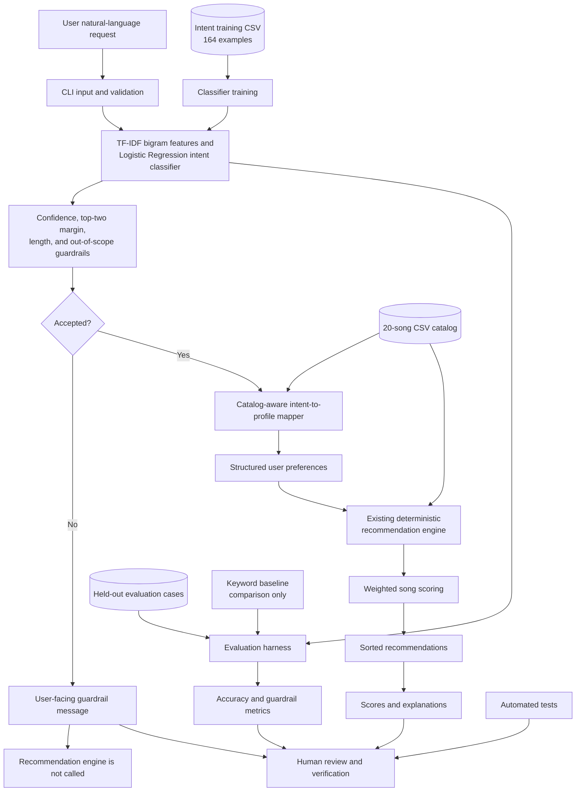

# Intentune: AI-Assisted Music Recommendation System

## Project Summary

Intentune is a command-line music recommender that lets a listener describe a listening goal in everyday English. It interprets that request as one of six supported music intents, applies reliability guardrails, converts an accepted intent into structured preferences, and returns ranked songs with numerical scores and inspectable explanations. The project demonstrates how a small, specialized AI component can improve usability without making the final ranking opaque.

## Original Project

This project extends the **CodePath Module 3 Music Recommender Simulation**. The original project loads a 20-song CSV catalog, accepts structured user preferences, and applies deterministic weighted scoring to rank songs. It explains each result using genre, mood, energy, and danceability contributions.

Project 4 adds natural-language interpretation and reliability evaluation around that existing recommender; it does not replace its ranking logic.

## New Applied-AI Extension

The Project 4 extension accepts a natural-language request and uses TF-IDF unigram/bigram vectorization with Logistic Regression to classify its listening intent. The classifier returns class probabilities, from which the system checks confidence and ambiguity. An accepted intent is mapped to a catalog-aware structured profile containing a genre, mood, energy target, and danceability target.

AI is responsible for interpreting the request. The existing deterministic recommender remains responsible for scoring and ranking songs, so every recommendation retains a predictable score and human-readable explanation.

## Supported Listening Intents

- `workout`
- `study`
- `relax`
- `party`
- `sleep`
- `mood_boost`

The classifier also learns an `out_of_scope` label. Non-music questions, unclear requests, and inputs that fail the length, confidence, or ambiguity checks are rejected with guidance instead of being converted into fabricated preferences.

## System Architecture



The Mermaid source is also available at [`diagrams/architecture.mmd`](diagrams/architecture.mmd). Accepted requests move from language classification to structured profile mapping and deterministic recommendation scoring. Rejected requests stop at the guardrail message; the recommender is not called. Automated tests, held-out evaluation, and human review check both paths.

## Repository Structure

```text
.
├── data/
│   ├── songs.csv
│   ├── intent_training_data.csv
│   └── intent_evaluation_cases.json
├── diagrams/
│   └── architecture.mmd
├── evidence/
│   ├── evaluation_results.txt
│   └── sample_runs.txt
├── scripts/
│   ├── evaluate_intent_model.py
│   └── run_sample_cases.py
├── src/
│   ├── ai/
│   │   ├── intent_classifier.py
│   │   ├── intent_profiles.py
│   │   └── keyword_baseline.py
│   ├── main.py
│   └── recommender.py
├── tests/
├── README.md
├── model_card.md
└── ai_interactions.md
```

## Setup Instructions

From a fresh clone:

```bash
git clone https://github.com/AkwasiSuapim/ai110-music_recommender_demo-starter.git
cd ai110-music_recommender_demo-starter
python3 -m venv .venv
source .venv/bin/activate
python -m pip install -r requirements.txt
```

On Windows, replace the activation command with:

```powershell
.venv\Scripts\activate
```

## Running the Application

Run a request directly:

```bash
python -m src.main --request "I need energetic music for a workout."
```

Request three results:

```bash
python -m src.main --request "Give me calm music while I study." --top-k 3
```

Or start interactive mode and enter a request at the prompt:

```bash
python -m src.main
```

`--top-k` accepts an integer from 1 through 10 and defaults to 5.

## Reproducible Sample Interactions

The following output is copied from [`evidence/sample_runs.txt`](evidence/sample_runs.txt), which is generated by the real CLI workflow.

### Workout request

```text
Intentune: AI-Assisted Music Recommendation System

Request:
I need energetic music for a workout.

Loaded songs: 20
AI interpretation:
Intent: workout
Confidence: 0.790
Genre target: pop
Mood target: energetic
Energy target: 0.90
Danceability target: 0.85

Recommendations:
1. Gym Hero — Max Pulse
   Score: 6.88/10
   Reasons:
   - genre match (+3.0)
   - mood did not match (+0.0)
   - energy similarity (+1.94)
   - danceability similarity (+1.94)
2. Blinding Lights — The Weeknd
   Score: 6.84/10
   Reasons:
   - genre did not match (+0.0)
   - mood match (+3.0)
   - energy similarity (+1.94)
   - danceability similarity (+1.90)
3. Sunrise City — Neon Echo
   Score: 6.72/10
   Reasons:
   - genre match (+3.0)
   - mood did not match (+0.0)
   - energy similarity (+1.84)
   - danceability similarity (+1.88)
4. Lose Yourself — Eminem
   Score: 3.66/10
   Reasons:
   - genre did not match (+0.0)
   - mood did not match (+0.0)
   - energy similarity (+1.96)
   - danceability similarity (+1.70)
5. Rooftop Lights — Indigo Parade
   Score: 3.66/10
   Reasons:
   - genre did not match (+0.0)
   - mood did not match (+0.0)
   - energy similarity (+1.72)
   - danceability similarity (+1.94)
```

### Study request

```text
Intentune: AI-Assisted Music Recommendation System

Request:
Give me calm music while I study.

Loaded songs: 20
AI interpretation:
Intent: study
Confidence: 0.795
Genre target: classical
Mood target: focused
Energy target: 0.30
Danceability target: 0.20

Recommendations:
1. Clair de Lune — Claude Debussy
   Score: 6.64/10
   Reasons:
   - genre match (+3.0)
   - mood did not match (+0.0)
   - energy similarity (+1.72)
   - danceability similarity (+1.92)
2. Focus Flow — LoRoom
   Score: 6.00/10
   Reasons:
   - genre did not match (+0.0)
   - mood match (+3.0)
   - energy similarity (+1.80)
   - danceability similarity (+1.20)
3. Spacewalk Thoughts — Orbit Bloom
   Score: 3.54/10
   Reasons:
   - genre did not match (+0.0)
   - mood did not match (+0.0)
   - energy similarity (+1.96)
   - danceability similarity (+1.58)
4. Oceans (Where Feet May Fail) — Hillsong United
   Score: 3.26/10
   Reasons:
   - genre did not match (+0.0)
   - mood did not match (+0.0)
   - energy similarity (+1.64)
   - danceability similarity (+1.62)
5. A Thousand Years — Christina Perri
   Score: 3.24/10
   Reasons:
   - genre did not match (+0.0)
   - mood did not match (+0.0)
   - energy similarity (+1.78)
   - danceability similarity (+1.46)
```

### Mood-boost request

```text
Intentune: AI-Assisted Music Recommendation System

Request:
I feel down and want something uplifting.

Loaded songs: 20
AI interpretation:
Intent: mood_boost
Confidence: 0.803
Genre target: pop
Mood target: happy
Energy target: 0.75
Danceability target: 0.70

Recommendations:
1. Sunrise City — Neon Echo
   Score: 9.68/10
   Reasons:
   - genre match (+3.0)
   - mood match (+3.0)
   - energy similarity (+1.86)
   - danceability similarity (+1.82)
2. Rooftop Lights — Indigo Parade
   Score: 6.74/10
   Reasons:
   - genre did not match (+0.0)
   - mood match (+3.0)
   - energy similarity (+1.98)
   - danceability similarity (+1.76)
3. Gym Hero — Max Pulse
   Score: 6.28/10
   Reasons:
   - genre match (+3.0)
   - mood did not match (+0.0)
   - energy similarity (+1.64)
   - danceability similarity (+1.64)
4. Night Drive Loop — Neon Echo
   Score: 3.94/10
   Reasons:
   - genre did not match (+0.0)
   - mood did not match (+0.0)
   - energy similarity (+2.00)
   - danceability similarity (+1.94)
5. Calm Down — Rema
   Score: 3.76/10
   Reasons:
   - genre did not match (+0.0)
   - mood did not match (+0.0)
   - energy similarity (+1.98)
   - danceability similarity (+1.78)
```

## Guardrail Examples

Whitespace-only input is rejected safely:

```text
Command: python3 -m src.main --request '   '
Exit code: 1

AI interpretation:
Request rejected.
I could not confidently identify a music-listening intent. Please mention an activity, mood, or listening goal such as workout, studying, relaxing, partying, sleeping, or improving your mood.
```

An unrelated request is also rejected:

```text
Request:
What is the weather tomorrow?

AI interpretation:
Request rejected.
I could not confidently identify a music-listening intent. Please mention an activity, mood, or listening goal such as workout, studying, relaxing, partying, sleeping, or improving your mood.
```

Inputs are stripped before validation. Blank input is rejected; nonblank input must be at least 3 and at most 500 characters. After inference, a music intent must have at least `0.35` confidence and a top-two probability margin of at least `0.05`. A predicted `out_of_scope` label is always rejected. The rejected path returns before the catalog is loaded or recommendation scoring is called, a behavior enforced by an integration test.

## Evaluation

Run the held-out evaluation and keyword-baseline comparison:

```bash
python scripts/evaluate_intent_model.py
```

Write the complete computed report to the evidence file:

```bash
python scripts/evaluate_intent_model.py --output evidence/evaluation_results.txt
```

The current evaluation contains 47 total cases, including 43 cases with a defined expected intent.

### Raw top-class intent accuracy

Raw top-class intent accuracy is **41/47 (87.23%)**. This legacy metric examines the model’s highest-probability class before the final guardrail decision and uses all 47 evaluation cases. Because four cases were designed only to test guardrail behavior and do not have an expected intent label, this metric should not be interpreted as the system’s final delivered-intent accuracy.

### Guardrail-aware delivered intent accuracy

Guardrail-aware delivered intent accuracy is **34/43 (79.07%)**. It evaluates the intent actually delivered by the system after guardrail decisions are applied. Low-confidence and ambiguous requests are represented as `__rejected__`, and only the 43 cases with a defined expected intent are included. This is the more useful end-to-end measure because it reflects both classification and rejection behavior.

| Metric | Result |
| --- | ---: |
| Trained classifier accuracy | 80.85% |
| Keyword baseline accuracy | 70.21% |
| Improvement over baseline | +10.64 percentage points |
| Raw top-class intent accuracy | 87.23% |
| Guardrail-aware delivered intent accuracy | 79.07% |
| Guardrail action accuracy | 82.98% |
| Macro precision | 95.41% |
| Macro recall | 74.29% |
| Macro F1 | 81.84% |
| Weighted F1 | 84.53% |
| Accept precision | 100.00% |
| Accept recall | 73.33% |
| Reject recall | 100.00% |
| False accepts | 0 |
| False rejects | 8 |

The classifier/baseline comparison remains 80.85% versus 70.21%; those scores are separate from the raw and delivered-intent measures above. In practical terms, the guarded system is conservative: every accepted request was supposed to be accepted, and every request that should have been rejected was rejected. However, eight valid music requests were rejected unnecessarily. The system therefore favors safety and precision over recall. That behavior demonstrates reliable rejection guardrails, but future versions should reduce false rejections.

Per intent, `party` achieved 100% precision, recall, and F1. `out_of_scope` achieved 100% recall and 96.30% F1; `workout` and `sleep` each achieved 88.89% F1; and `mood_boost` achieved 75.00% F1. `study` reached 66.67% F1 and had the lowest precision at 75.00%, while `relax` had the lowest recall at 40.00% and the lowest F1 at 57.14%. Figurative requests such as “melt into the sofa” were difficult for the small TF-IDF training dataset. Full case-level results and confusion matrices are in [`evidence/evaluation_results.txt`](evidence/evaluation_results.txt).

## Testing

```bash
python -m pytest -q
```

Current verified result:

```text
107 passed
```

The complete test suite contains 107 passing tests. Tests cover dataset schema and label validation, training/evaluation separation, classifier determinism, all six listening intents, input and inference guardrails, structured profile mapping, catalog-aware fallbacks, CLI integration and top-k validation, precision/recall/F1 and confusion-matrix evaluation, and comparison with the keyword baseline. The original deterministic recommender tests remain part of the suite.

## Design Decisions

1. **Offline classifier instead of an external LLM API.** TF-IDF and Logistic Regression make the project reproducible, inexpensive to run, private by default, and usable without network access.
2. **AI for interpretation; deterministic logic for ranking.** The model handles flexible language, while the existing weighted recommender provides stable, inspectable song rankings.
3. **Confidence and margin guardrails.** Both absolute confidence and separation from the second-ranked class must pass, reducing unsupported mappings from uncertain predictions.
4. **Catalog-aware genre and mood selection.** Intent priorities are checked against the actual CSV; when no preferred value exists, the mapper uses a deterministic most-frequent catalog fallback instead of inventing metadata.
5. **Keyword baseline only for evaluation.** The baseline provides a transparent comparison but is never part of the application path.
6. **Logistic Regression `C=10.0`.** With this small seven-class dataset, default `C=1.0` produced probabilities too close together for the selected confidence threshold, causing apparently clear requests to be rejected. `C=10.0` allowed the verified clear samples to pass while uncertain cases remained guarded. This calibration is specific to this dataset and threshold, not a claim that `C=10.0` is universally optimal.

## Trade-offs and Limitations

- The 164-example training set is small and uses project-specific synthetic/manual phrasing.
- The catalog contains only 20 songs and cannot represent broad musical taste.
- Six music-intent labels cannot capture every listening goal.
- Figurative or indirect language may be rejected or misclassified.
- Confidence is a model probability, not a guarantee of correctness.
- Confidence thresholds and `C=10.0` are dataset-specific calibrations.
- There is no external music catalog or provider integration.
- The system has no long-term user history, feedback learning, or personalization memory.
- It performs no audio analysis.
- Genre and mood scoring requires exact text matches; related values receive no partial credit.
- Training wording and catalog selection may introduce linguistic, cultural, genre, and mood bias.

## Responsible AI

Intentune makes no external API calls and performs no user tracking. Logging records request length and prediction metadata, not the complete raw request. Rejected input never receives an invented structured profile, and recommendation explanations make the deterministic ranking inspectable. The classifier and results can still reflect bias in the training phrases and the small song catalog, so confidence should not be read as certainty.

## Reflection

This project taught me that AI is most useful when its role and failure boundary are explicit. Separating uncertain language interpretation from deterministic ranking made it possible to improve the interface while preserving testable scoring, clear explanations, and a safe rejection path. Evaluation also showed that a model can outperform a simple baseline and still have important weaknesses worth documenting.

The complete AI-collaboration and system-design reflection appears in [`model_card.md`](model_card.md).

## Portfolio Statement

This project says that I approach AI engineering as system design, not just model selection. I can integrate a focused classifier into existing software, define guardrails, build a reproducible baseline and evaluation harness, preserve explainable deterministic behavior, and report failures honestly.

## Future Improvements

Future work could expand and diversify the training set, support broader listening intents, improve probability calibration, use a richer catalog, incorporate explicit user feedback, optionally connect to an external music provider, and adopt more sophisticated language understanding. These are proposed improvements, not implemented features.
